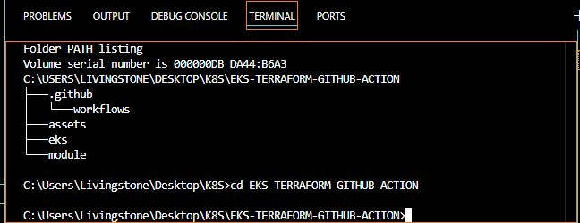
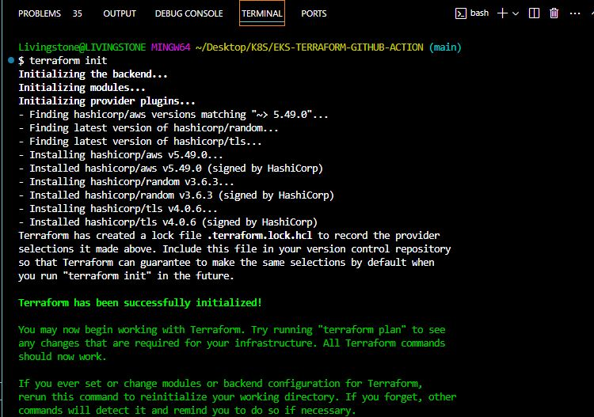
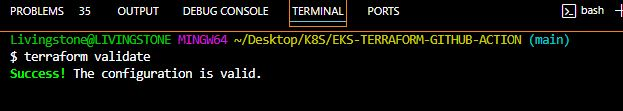
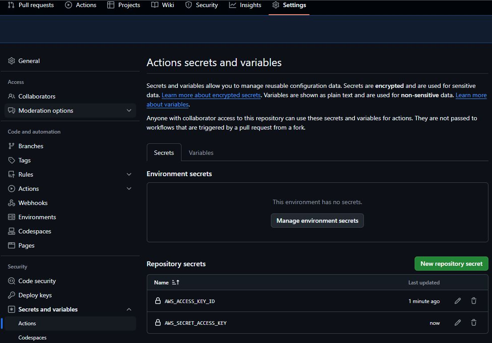
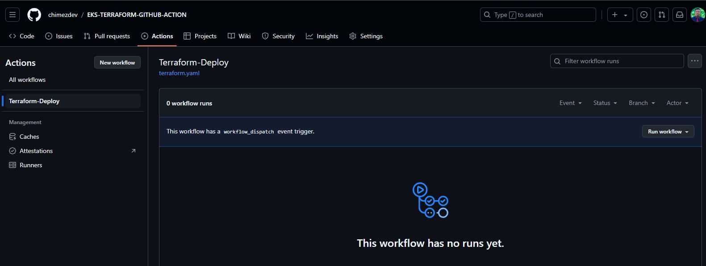
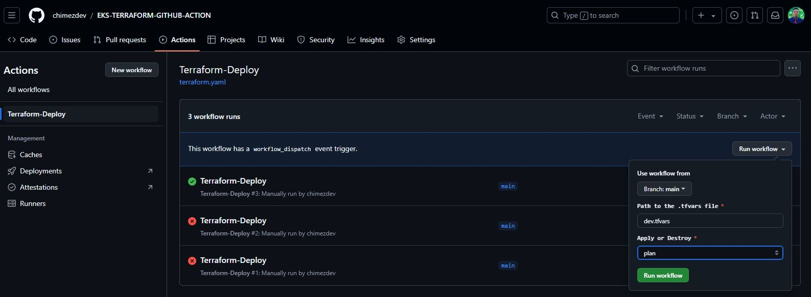
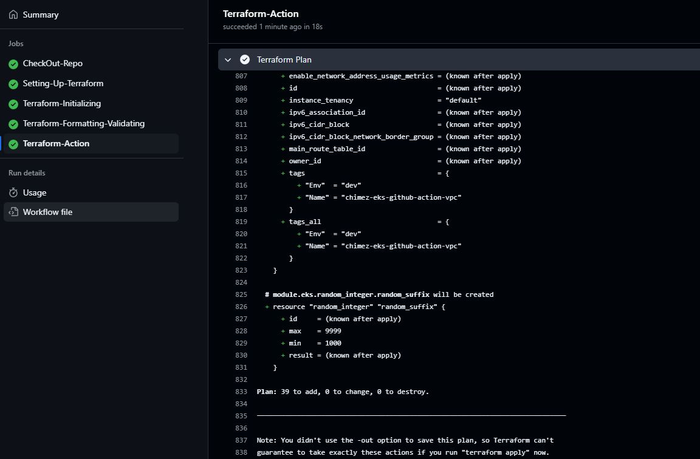
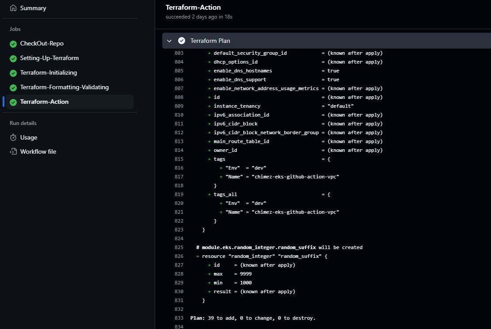

# PROVISIONING OF PRODUCTION-READY AMAZON EKS CLUSTER WITH TERRAFORM AND GITHUB ACTIONS
Shoutout to @AmanPathak-DevOps, the original owner of this project. [GitHub](https://github.com/AmanPathak-DevOps/EKS-Terraform-GitHub-Actions?tab=readme-ov-file)

This repository **Provisioning of Production-Ready Amazon EKS Clusters with Terraform and Automating Deployment with GitHub Actions** accompanies a blog post by @AmanPathak-DevOps and demonstrates the practical steps to set up and automate an EKS cluster deployment.

## Project Overview
This project covers:
- **Infrastructure as Code (IaC)**: Use Terraform to define and manage your EKS cluster.
- **CI/CD Automation**: Leverage GitHub Actions to automate deployments.
- **Kubernetes Deployment using AWS Kubernetes offering EKS

## Contributing
Contributions are welcome! Please open an issue or submit a pull request for any improvements or bug fixes.

## License
This project is licensed under the Apache 2.0 License. See the [LICENSE](LICENSE) file for details.

## Pre-reuisites
You need to understand the following in other to make the best out of this project.

-   Must have an AWS Account. Preferrably an AWS freetier account
-   Must have AWS IAM credentials with Administrator Access(always avoid Administrator Access and follow the least privileged permissions)
-   Have a good understanding of Terraform
-   Have basic understanding of YAML files for GitHub Actions workflow.

### Directory Structure

**module directory** - Contains the resource scripts related to the EKS cluster and it’s required service(IAM, VPC, etc).

**eks directory** - Here, we will create the resources according to our requirements and we will call the resources module from module directory.

Lets begin with the module directory files:

**gather.tf**
See the file ***/module/gather.tf*** Read the comments to understand what the certificate does.

**vpc.tf**
See file /module/vpc.tf. Setup for AWS services related to VPC including VPC, internet gateway, public subnet and private subnets(with the desired number of subnets), public and private route tables respective to their type of subnets, NAT Gateway, elastic IP (required for NAT Gateway), security group for EKS cluster to restrict the access for specific people only

**iam.tf**
Created roles for our EKS cluster and node group, **AmazonEKSClusterPolicy**. Along with that, we have created an OIDC role for our EKS Cluster.

**eks.tf**
In this file, we have configured AWS EKS with private access point and Private node groups. Two node groups types were created, **ON-DEMAND** and **SPOT**

**variables.tf**
This file holds the required parameters for the service(IAM, VPC, EKS etc)

**backend.tf**
Here, we will configure which provider, in this case, AWS, version and where our terraform state file will be stored and dynamoDB for LOCKING. We are going to be using the S3 bucket we provisioned earlier(manually).

**main.tf**
From here, we are calling all the configuration in module directory. We will provide values for the variables used for the services. Terraform will assign higher importance to any value found here before checking the ***.tfvars*** file.

**dev.tfvars**
This is where we initialized the value(s) for each variable. If you want to deploy the same services in the multiple environment then you can create new tfvars file as dev.tfvars. Then, create a different backend.tf file and apply the changes with different tfvars file.

## Validate Configuration files
At this stage, all our terraform configuration files are ready. But to be sure we have made no syntax or spelling error, let us validate our configuration.
- run `terraform init` from the root directory

- run `terraform validate` to verify that our configuration is free from error or misconfiguration. You should see like the sample screenshot below. If not kindly troubleshoot and run again.

## Configure CI/CD Deployment Automation using GitHub Action

### Add AWS credentials as repository secrets
As mentioned in the prerequisite, get your downloaded AWS IAM credentials and save as GitHub secrets in your project repository.

- Navigate to the settings of your GitHub repository and click on **Secrets and variables**
- Click on Actions and Add your keys in the secrets section. Create **New Repository Secret**
- Use the same secrets names as shown on the image.

### Create a Workflow(written in yaml) to deploy to resources to AWS
- create a ***.github/workflow*** directory in the root directory.
- create a ***terraform.yaml*** file in the directory
- write the yaml configuration file. Check ***.github/workflows/terraform.yaml***

The Workflow will be triggered manually and configured to accept two parameters (tfvars file name and apply or destroy action).

From your repository, click on the **Actions** tab and select **Terraform-Deploy**

## Run Workflow Manually
To run the workflow, you need to provide a parameter.
- Click on Run workflow after providing the arguments(Initially we will run plan only).

The Plan stage is Successful.

Plan: 39 to add, 0 to destroy or change.

Now you can run the apply stage.
Click on **Terraform-Action** then Click on the greater than (>) symbol to expand and view the logs.

Apply stage is successful

## Validate Resources on AWS Console.

**VPC**

VPC resource

**Public & Private Subnets**

Created subnets

**NAT Gateway**

NAT Gateway resource

**EKS Cluster**

EKS Cluster

**NodeGroups**

Node groups and nodes

View ec2 instance created from the EC2 console

** OIDC Connector **

**Installed Add-ons**

## Teardown Resources
To destroy, select the destroy option from the parameters.

Terraform destroy successful

Verify on the console that all resources have been terminated.

## Congratulations
Well done configuring this Production-ready EKS Cluster. 

## Assignment
- Deploy a simple nginx application to your cluster.

HAPPY LEARNING!